# MLEvolve 技术设计文档

## 目录

1. [项目概述](#1-项目概述)
2. [系统本体设计 (Ontology Design)](#2-系统本体设计-ontology-design)
   - 2.1 [核心领域模型](#21-核心领域模型)
   - 2.2 [实体关系图](#22-实体关系图)
   - 2.3 [状态机模型](#23-状态机模型)
3. [时序设计 (Sequence Design)](#3-时序设计-sequence-design)
   - 3.1 [系统启动时序](#31-系统启动时序)
   - 3.2 [搜索主循环时序](#32-搜索主循环时序)
   - 3.3 [节点生成与执行时序](#33-节点生成与执行时序)
   - 3.4 [并行执行时序](#34-并行执行时序)
   - 3.5 [结果解析与评估时序](#35-结果解析与评估时序)
4. [算法设计 (Algorithm Design)](#4-算法设计-algorithm-design)
   - 4.1 [蒙特卡洛图搜索 (MCGS)](#41-蒙特卡洛图搜索-mcgs)
   - 4.2 [UCT 选择算法](#42-uct-选择算法)
   - 4.3 [探索-利用软切换算法](#43-探索-利用软切换算法)
   - 4.4 [Top-K 加权选择算法](#44-top-k-加权选择算法)
   - 4.5 [停滞检测与自适应策略](#45-停滞检测与自适应策略)
   - 4.6 [反向传播与奖励计算](#46-反向传播与奖励计算)
   - 4.7 [分支管理与融合策略](#47-分支管理与融合策略)
   - 4.8 [全局记忆与混合检索](#48-全局记忆与混合检索)
   - 4.9 [探索常数衰减算法](#49-探索常数衰减算法)
   - 4.10 [Diff 模式代码生成](#410-diff-模式代码生成)
5. [模块架构设计](#5-模块架构设计)
   - 5.1 [整体架构](#51-整体架构)
   - 5.2 [Agent 子系统](#52-agent-子系统)
   - 5.3 [Engine 子系统](#53-engine-子系统)
   - 5.4 [LLM 抽象层](#54-llm-抽象层)
   - 5.5 [代码生成子系统](#55-代码生成子系统)
   - 5.6 [验证与质量保障子系统](#56-验证与质量保障子系统)
6. [配置体系](#6-配置体系)
7. [数据流设计](#7-数据流设计)

---

## 1. 项目概述

**MLEvolve** 是一个智能体驱动的机器学习工程系统，旨在自动化解决 Kaggle 风格的 ML 竞赛任务。系统的核心创新在于将**蒙特卡洛图搜索 (Monte Carlo Graph Search, MCGS)** 与**多智能体协作**相结合，通过规划 (Planning)、编码 (Coding)、调试 (Debugging)、融合 (Fusion) 和进化 (Evolution) 等多种策略，在解空间中高效搜索最优 ML 解决方案。

**技术栈**: Python 3、PyTorch、Google Gemini / OpenAI-compatible LLMs、OmegaConf、Flask、FAISS

**核心能力**:
- 自动生成、执行、评估 ML 解决方案代码
- 基于 MCTS 的解空间树搜索
- 多分支并行探索与跨分支融合
- 自适应探索-利用平衡策略
- 全局记忆驱动的经验复用
- 集成 mle-bench 提交格式验证

---

## 2. 系统本体设计 (Ontology Design)

### 2.1 核心领域模型

系统的本体由以下核心实体构成：

#### 2.1.1 SearchNode（搜索节点）

搜索节点是整个系统的核心数据实体，代表解空间中的一个候选解决方案。

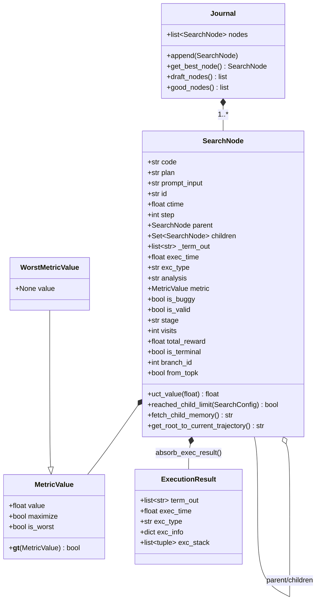
```mermaid
classDiagram
    class SearchNode {
        +str code
        +str plan
        +str prompt_input
        +str id
        +float ctime
        +int step
        +SearchNode parent
        +Set~SearchNode~ children
        +list~str~ _term_out
        +float exec_time
        +str exc_type
        +str analysis
        +MetricValue metric
        +bool is_buggy
        +bool is_valid
        +str stage
        +int visits
        +float total_reward
        +bool is_terminal
        +int branch_id
        +bool from_topk
        +uct_value(float) float
        +reached_child_limit(SearchConfig) bool
        +fetch_child_memory() str
        +get_root_to_current_trajectory() str
    }

    class MetricValue {
        +float value
        +bool maximize
        +bool is_worst
        +__gt__(MetricValue) bool
    }

    class WorstMetricValue {
        +None value
    }

    class ExecutionResult {
        +list~str~ term_out
        +float exec_time
        +str exc_type
        +dict exc_info
        +list~tuple~ exc_stack
    }

    class Journal {
        +list~SearchNode~ nodes
        +append(SearchNode)
        +get_best_node() SearchNode
        +draft_nodes() list
        +good_nodes() list
    }

    SearchNode *-- MetricValue
    SearchNode *-- ExecutionResult : absorb_exec_result()
    SearchNode o-- SearchNode : parent/children
    WorstMetricValue --|> MetricValue
    Journal *-- SearchNode : 1..*
```

```
SearchNode
├── 代码与计划 (Code & Plan)
│   ├── code: str              # 完整的 Python 解决方案代码
│   ├── plan: str              # 自然语言的方案设计描述
│   └── prompt_input: str      # 生成该节点时使用的 LLM prompt
│
├── 通用属性 (General)
│   ├── id: str (UUID)         # 全局唯一标识符
│   ├── ctime: float           # 创建时间戳
│   ├── step: int              # 在 Journal 中的序号
│   ├── parent: SearchNode     # 父节点引用
│   └── children: Set          # 子节点集合
│
├── 执行信息 (Execution)
│   ├── _term_out: list[str]   # 终端输出
│   ├── exec_time: float       # 执行耗时
│   ├── exc_type: str          # 异常类型
│   ├── exc_info: dict         # 异常信息
│   └── exc_stack: list        # 异常栈
│
├── 评估信息 (Evaluation)
│   ├── analysis: str          # LLM 生成的结果分析
│   ├── metric: MetricValue    # 验证指标值
│   ├── is_buggy: bool         # 是否有 bug
│   └── is_valid: bool         # 提交格式是否有效
│
├── 搜索/MCTS 元数据 (Search/MCTS)
│   ├── stage: Literal["root","improve","debug","draft","fusion_draft","evolution","fusion"]
│   ├── visits: int            # 访问次数
│   ├── total_reward: float    # 累计奖励
│   ├── is_terminal: bool      # 是否为终止节点
│   ├── _uct: float            # UCT 值缓存
│   ├── local_best_node: SearchNode  # 当前改进链的最佳节点
│   ├── continue_improve: bool # 是否继续改进
│   ├── improve_failure_depth: int   # 连续改进失败深度
│   └── lock: bool             # 并发锁标志
│
├── 贝叶斯采样 (Bayesian Sampling)
│   ├── alpha: int = 1         # Beta 分布参数 α
│   └── beta: int = 1          # Beta 分布参数 β
│
└── 分支管理 (Branch)
    ├── branch_id: int         # 所属分支 ID
    ├── from_topk: bool        # 是否来自 Top-K 利用
    ├── code_summary: str      # 代码摘要
    └── work_dir: str          # 工作目录
```

**节点阶段 (Stage) 类型定义**：

| Stage | 含义 | 触发条件 |
|-------|------|---------|
| `root` | 虚拟根节点 | 系统初始化 |
| `draft` | 初始草案 | 从根节点创建新分支 |
| `improve` | 改进迭代 | 对非 buggy 节点的优化 |
| `debug` | 调试修复 | 对 buggy 节点的修复 |
| `evolution` | 进化优化 | 分支停滞时基于轨迹的进化 |
| `fusion` | 跨分支融合 | 从其他分支汲取经验 |
| `fusion_draft` | 聚合草案 | 多分支聚合生成全新方案 |

#### 2.1.2 Journal（日志/解树）

Journal 是 SearchNode 的有序集合，构成完整的解搜索树：

```
Journal
├── nodes: list[SearchNode]     # 按加入顺序排列的所有节点
├── draft_nodes → [SearchNode]  # 所有没有父节点的根草案节点
├── good_nodes → [SearchNode]   # 所有非 buggy 的节点
└── get_best_node() → SearchNode # 返回最佳指标值的节点
```

#### 2.1.3 MetricValue（指标值）

MetricValue 封装了评估指标的值和优化方向：

```
MetricValue
├── value: float | None        # 指标数值
├── maximize: bool | None      # True=越大越好, False=越小越好
├── is_worst: bool             # 是否为最差值（value=None）
└── 支持 __gt__ 比较           # 自动根据 maximize 方向比较
```

`WorstMetricValue` 是 `MetricValue` 的子类，`value` 固定为 `None`，在任何比较中总是最差的。

#### 2.1.4 ExecutionResult（执行结果）

代表一次代码执行的完整结果：

```
ExecutionResult
├── term_out: list[str]        # 标准输出和标准错误
├── exec_time: float           # 执行耗时（秒）
├── exc_type: str | None       # 异常类型字符串
├── exc_info: dict | None      # 异常附加信息
└── exc_stack: list[tuple]     # 解析后的异常调用栈
```

#### 2.1.5 AgentSearch（搜索协调器）

AgentSearch 是系统的核心协调器，管理整个搜索过程：

```
AgentSearch
├── 配置 (cfg, acfg, scfg)
├── 任务描述 (task_desc, data_preview)
├── 搜索状态
│   ├── journal: Journal           # 解树
│   ├── virtual_root: SearchNode   # 虚拟根节点
│   ├── current_step: int          # 当前步数
│   ├── best_metric / best_node    # 全局最佳
│   ├── top_candidates: List       # Top-K 候选列表
│   └── metric_maximize: bool      # 指标优化方向
├── 分支管理
│   ├── next_branch_id: int
│   ├── branch_all_nodes: Dict[int, List]
│   ├── branch_successful_nodes: Dict[int, List]
│   └── branch_node_count: Dict[int, int]
├── 停滞检测
│   ├── best_metric_history: list
│   ├── stagnation_threshold: int
│   └── improve_attempts_count: int
├── 全局记忆 (global_memory: GlobalMemoryLayer)
└── 并发控制 (journal_lock, save_node_lock)
```

#### 2.1.6 Config（配置体系）

分层配置数据模型：

```
Config
├── 数据与路径 (data_dir, dataset_dir, workspace_dir, log_dir)
├── ExecConfig (timeout, agent_file_name)
├── AgentConfig
│   ├── 基本参数 (steps, time_limit, initial_drafts, seed)
│   ├── StageConfig (code: model/temp/base_url/api_key)
│   ├── StageConfig (feedback: model/temp/base_url/api_key)
│   ├── SearchConfig (搜索树参数)
│   ├── DecayConfig (探索常数衰减参数)
│   └── 全局记忆参数
└── ColdstartConfig (冷启动知识库)
```

#### 2.1.7 MemRecord（记忆记录）

全局记忆中的一条经验记录：

```
MemRecord
├── record_id: str        # 唯一 ID (node_{uuid})
├── title: str            # 标题 (stage - id[:8])
├── description: str      # 方案计划
├── method: str           # 代码摘要
├── label: int            # 结果标签 (1=改进, 0=持平, -1=退步)
└── timestamp: str        # ISO 时间戳
```

### 2.2 实体关系图

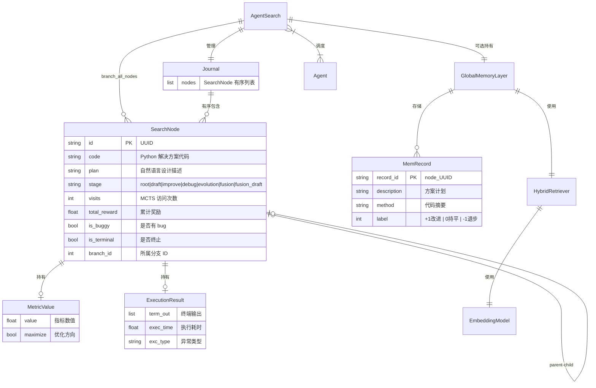
```mermaid
erDiagram
    AgentSearch ||--|| Journal : "管理"
    AgentSearch ||--|| GlobalMemoryLayer : "可选持有"
    AgentSearch ||--o{ SearchNode : "branch_all_nodes"
    AgentSearch }|--|{ Agent : "调度"

    Journal ||--o{ SearchNode : "有序包含"

    SearchNode ||--o| MetricValue : "持有"
    SearchNode ||--o| ExecutionResult : "持有"
    SearchNode o|--o| SearchNode : "parent-child"

    GlobalMemoryLayer ||--o{ MemRecord : "存储"
    GlobalMemoryLayer ||--|| HybridRetriever : "使用"
    HybridRetriever ||--|| EmbeddingModel : "使用"

    SearchNode {
        string id PK "UUID"
        string code "Python 解决方案代码"
        string plan "自然语言设计描述"
        string stage "root|draft|improve|debug|evolution|fusion|fusion_draft"
        int visits "MCTS 访问次数"
        float total_reward "累计奖励"
        bool is_buggy "是否有 bug"
        bool is_terminal "是否终止"
        int branch_id "所属分支 ID"
    }

    MetricValue {
        float value "指标数值"
        bool maximize "优化方向"
    }

    ExecutionResult {
        list term_out "终端输出"
        float exec_time "执行耗时"
        string exc_type "异常类型"
    }

    MemRecord {
        string record_id PK "node_UUID"
        string description "方案计划"
        string method "代码摘要"
        int label "+1改进 | 0持平 | -1退步"
    }

    Journal {
        list nodes "SearchNode 有序列表"
    }
```

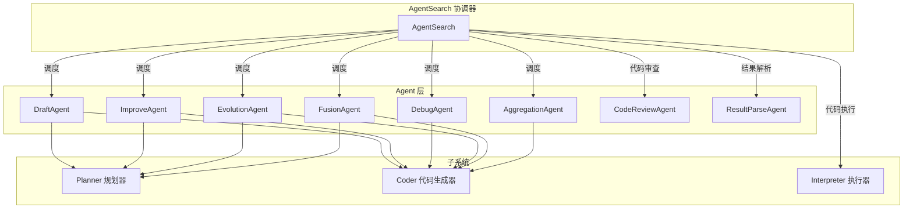
```mermaid
graph TB
    subgraph "AgentSearch 协调器"
        AS[AgentSearch]
    end

    subgraph "Agent 层"
        DA[DraftAgent]
        IA[ImproveAgent]
        DBA[DebugAgent]
        EA[EvolutionAgent]
        FA[FusionAgent]
        AA[AggregationAgent]
        CRA[CodeReviewAgent]
        RPA[ResultParseAgent]
    end

    subgraph "子系统"
        PL[Planner 规划器]
        CD[Coder 代码生成器]
        INT[Interpreter 执行器]
    end

    AS -->|调度| DA & IA & DBA & EA & FA & AA
    AS -->|代码审查| CRA
    AS -->|结果解析| RPA
    DA & IA & EA & FA --> PL
    DA & IA & DBA & EA & FA & AA --> CD
    AS -->|代码执行| INT
```

### 2.3 状态机模型

#### 2.3.1 SearchNode 生命周期状态

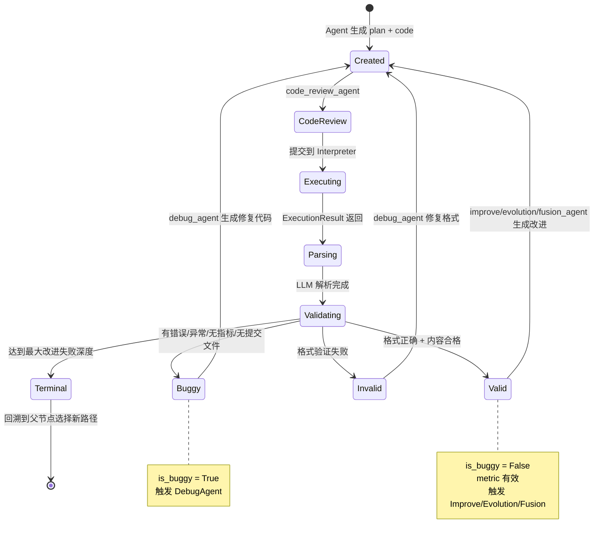
```mermaid
stateDiagram-v2
    [*] --> Created: Agent 生成 plan + code

    Created --> CodeReview: code_review_agent
    CodeReview --> Executing: 提交到 Interpreter

    Executing --> Parsing: ExecutionResult 返回
    Parsing --> Validating: LLM 解析完成

    Validating --> Buggy: 有错误/异常/无指标/无提交文件
    Validating --> Valid: 格式正确 + 内容合格
    Validating --> Invalid: 格式验证失败
    Validating --> Terminal: 达到最大改进失败深度

    Buggy --> Created: debug_agent 生成修复代码
    Valid --> Created: improve/evolution/fusion_agent 生成改进
    Invalid --> Created: debug_agent 修复格式
    Terminal --> [*]: 回溯到父节点选择新路径

    note right of Buggy
        is_buggy = True
        触发 DebugAgent
    end note

    note right of Valid
        is_buggy = False
        metric 有效
        触发 Improve/Evolution/Fusion
    end note
```

#### 2.3.2 搜索阶段切换状态机

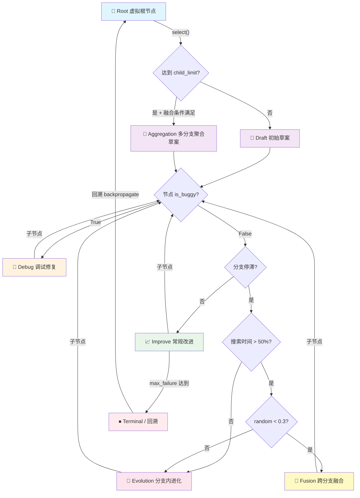
```mermaid
flowchart TD
    Root["🌳 Root 虚拟根节点"]
    ChildLimit{"达到 child_limit?"}
    Draft["📝 Draft 初始草案"]
    Aggregation["🔗 Aggregation 多分支聚合草案"]
    IsBuggy{"节点 is_buggy?"}
    Debug["🔧 Debug 调试修复"]
    Stagnant{"分支停滞?"}
    Improve["📈 Improve 常规改进"]
    TimeCheck{"搜索时间 > 50%?"}
    Evolution["🧬 Evolution 分支内进化"]
    FusionRandom{"random < 0.3?"}
    Fusion["🔀 Fusion 跨分支融合"]
    Terminal["⏹ Terminal / 回溯"]

    Root -->|"select()"| ChildLimit
    ChildLimit -->|否| Draft
    ChildLimit -->|"是 + 融合条件满足"| Aggregation
    Draft --> IsBuggy
    Aggregation --> IsBuggy
    IsBuggy -->|True| Debug
    IsBuggy -->|False| Stagnant
    Debug -->|子节点| IsBuggy
    Stagnant -->|否| Improve
    Stagnant -->|是| TimeCheck
    TimeCheck -->|否| Evolution
    TimeCheck -->|是| FusionRandom
    FusionRandom -->|是| Fusion
    FusionRandom -->|否| Evolution
    Improve -->|子节点| IsBuggy
    Evolution -->|子节点| IsBuggy
    Fusion -->|子节点| IsBuggy
    Improve -->|"max_failure 达到"| Terminal
    Terminal -->|"回溯 backpropagate"| Root

    style Root fill:#e1f5fe
    style Draft fill:#f3e5f5
    style Debug fill:#fff3e0
    style Improve fill:#e8f5e9
    style Evolution fill:#fce4ec
    style Fusion fill:#fff9c4
    style Aggregation fill:#f3e5f5
    style Terminal fill:#ffebee
```

---

## 3. 时序设计 (Sequence Design)

### 3.1 系统启动时序

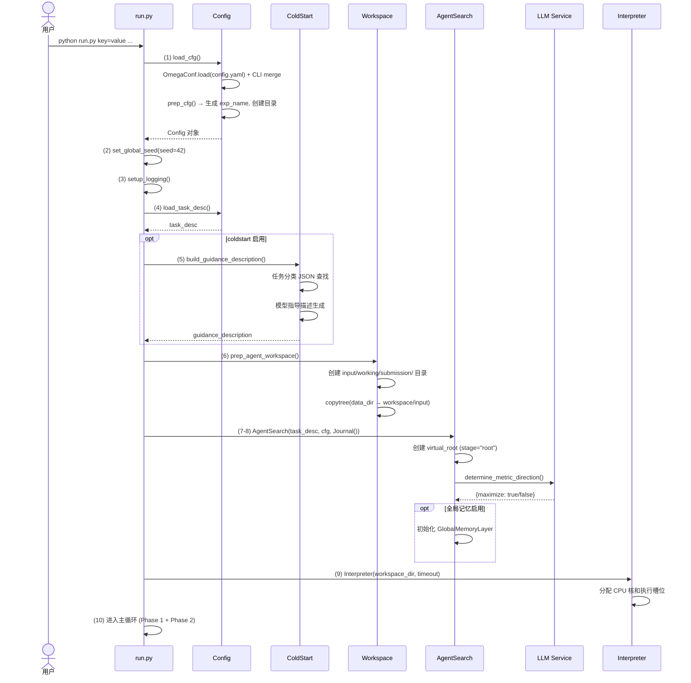
```mermaid
sequenceDiagram
    actor User as 用户
    participant Run as run.py
    participant Cfg as Config
    participant ColdStart as ColdStart
    participant WS as Workspace
    participant AS as AgentSearch
    participant LLM as LLM Service
    participant Interp as Interpreter

    User->>Run: python run.py key=value ...

    Run->>Cfg: (1) load_cfg()
    Cfg->>Cfg: OmegaConf.load(config.yaml) + CLI merge
    Cfg->>Cfg: prep_cfg() → 生成 exp_name, 创建目录
    Cfg-->>Run: Config 对象

    Run->>Run: (2) set_global_seed(seed=42)
    Run->>Run: (3) setup_logging()
    Run->>Cfg: (4) load_task_desc()
    Cfg-->>Run: task_desc

    opt coldstart 启用
        Run->>ColdStart: (5) build_guidance_description()
        ColdStart->>ColdStart: 任务分类 JSON 查找
        ColdStart->>ColdStart: 模型指导描述生成
        ColdStart-->>Run: guidance_description
    end

    Run->>WS: (6) prep_agent_workspace()
    WS->>WS: 创建 input/working/submission/ 目录
    WS->>WS: copytree(data_dir → workspace/input)

    Run->>AS: (7-8) AgentSearch(task_desc, cfg, Journal())
    AS->>AS: 创建 virtual_root (stage="root")
    AS->>LLM: determine_metric_direction()
    LLM-->>AS: {maximize: true/false}
    opt 全局记忆启用
        AS->>AS: 初始化 GlobalMemoryLayer
    end

    Run->>Interp: (9) Interpreter(workspace_dir, timeout)
    Interp->>Interp: 分配 CPU 核和执行槽位

    Run->>Run: (10) 进入主循环 (Phase 1 + Phase 2)
```

### 3.2 搜索主循环时序

MLEvolve 的搜索主循环分两个阶段执行：

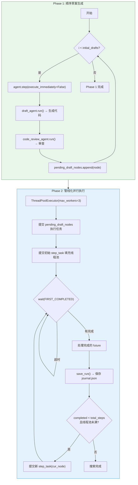
```mermaid
flowchart TB
    subgraph Phase1["Phase 1: 顺序草案生成"]
        direction TB
        P1Start["开始"] --> P1Loop{"i < initial_drafts?"}
        P1Loop -->|是| P1Step["agent.step(execute_immediately=False)"]
        P1Step --> P1Draft["draft_agent.run() → 生成代码"]
        P1Draft --> P1Review["code_review_agent.run() → 审查"]
        P1Review --> P1Append["pending_draft_nodes.append(node)"]
        P1Append --> P1Loop
        P1Loop -->|否| P1End["Phase 1 完成"]
    end

    subgraph Phase2["Phase 2: 管线化并行执行"]
        direction TB
        P2Start["ThreadPoolExecutor(max_workers=3)"]
        P2Submit["提交 pending_draft_nodes 执行任务"]
        P2Fill["提交初始 step_task 填充线程池"]
        P2Wait{"wait(FIRST_COMPLETED)"}
        P2Process["处理完成的 future"]
        P2Save["save_run() → 保存 journal.json"]
        P2Check{"completed < total_steps<br>且线程池未满?"}
        P2New["提交新 step_task(cur_node)"]
        P2Done["搜索完成"]

        P2Start --> P2Submit --> P2Fill --> P2Wait
        P2Wait -->|有完成| P2Process --> P2Save --> P2Check
        P2Wait -->|超时| P2Wait
        P2Check -->|是| P2New --> P2Wait
        P2Check -->|否| P2Done
    end

    Phase1 --> Phase2

    style Phase1 fill:#e8f5e9,stroke:#43a047
    style Phase2 fill:#e3f2fd,stroke:#1e88e5
```

### 3.3 节点生成与执行时序

每次 `agent.step()` 调用的详细时序：

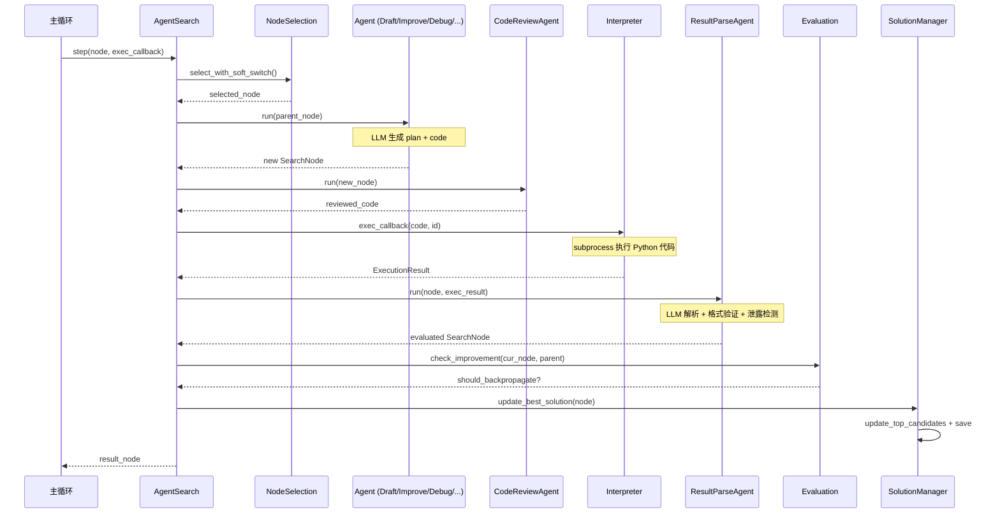
```mermaid
sequenceDiagram
    participant Main as 主循环
    participant AS as AgentSearch
    participant NS as NodeSelection
    participant Agt as Agent (Draft/Improve/Debug/...)
    participant CR as CodeReviewAgent
    participant Exec as Interpreter
    participant RP as ResultParseAgent
    participant Eval as Evaluation
    participant SM as SolutionManager

    Main->>AS: step(node, exec_callback)
    AS->>NS: select_with_soft_switch()
    NS-->>AS: selected_node

    AS->>Agt: run(parent_node)
    Note over Agt: LLM 生成 plan + code
    Agt-->>AS: new SearchNode

    AS->>CR: run(new_node)
    CR-->>AS: reviewed_code

    AS->>Exec: exec_callback(code, id)
    Note over Exec: subprocess 执行 Python 代码
    Exec-->>AS: ExecutionResult

    AS->>RP: run(node, exec_result)
    Note over RP: LLM 解析 + 格式验证 + 泄露检测
    RP-->>AS: evaluated SearchNode

    AS->>Eval: check_improvement(cur_node, parent)
    Eval-->>AS: should_backpropagate?

    AS->>SM: update_best_solution(node)
    SM->>SM: update_top_candidates + save

    AS-->>Main: result_node
```

```
agent.step(node, exec_callback)
  │
  ├─(1)─► 首次调用时初始化
  │       ├── update_data_preview() → 扫描 workspace 生成数据预览
  │       └── search_start_time = time.time()
  │
  ├─(2)─► 节点选择 (如果 node 为 root 或 None)
  │       └── select_with_soft_switch(agent)
  │           ├── 计算 time_progress = elapsed / time_limit
  │           ├── 计算 exploration_weight → 随时间衰减
  │           ├── random() < exploration_weight ?
  │           │   ├── 是 → select(agent, virtual_root) [UCT]
  │           │   └── 否 → get_top_k_nodes_global() + 加权选择 [Top-K]
  │           └── 返回选中的节点
  │
  ├─(3)─► _run_single_step(parent_node, exec_callback)
  │       │
  │       ├── [如果是根节点]
  │       │   ├── reached_child_limit? → aggregation_agent.run()
  │       │   └── 否则 → draft_agent.run()
  │       │
  │       ├── [如果 parent 是 buggy]
  │       │   └── debug_agent.run()
  │       │
  │       ├── [如果 parent 非 buggy]
  │       │   ├── is_branch_stagnant?
  │       │   │   ├── 时间 > 50%?
  │       │   │   │   ├── random < fusion_prob → fusion_agent.run()
  │       │   │   │   └── 否则 → evolution_agent.run()
  │       │   │   └── 否则 → evolution_agent.run()
  │       │   └── 否则 → improve_agent.run()
  │       │
  │       ├── code_review_agent.run(node) → 代码审查 + 修正
  │       │
  │       ├── exec_callback(code, id) → Interpreter.run()
  │       │   ├── 分配 CPU 槽位
  │       │   ├── isolate_submission_path() → 隔离提交文件名
  │       │   ├── isolate_model_path() → 隔离模型文件名
  │       │   ├── subprocess.Popen() → 在子进程中执行
  │       │   ├── communicate(timeout) → 等待完成
  │       │   └── 返回 ExecutionResult
  │       │
  │       ├── result_parse_agent.run(node, exec_result)
  │       │   ├── absorb_exec_result() → 吸收执行结果
  │       │   ├── LLM query → 解析 is_bug, metric, summary
  │       │   ├── _check_submission_file() → 检查提交文件
  │       │   ├── _validate_format_with_retry() → 格式验证
  │       │   ├── _validate_metric_direction() → 指标方向验证
  │       │   ├── _check_data_leakage() → 数据泄露检查
  │       │   └── _save_to_global_memory() → 保存到全局记忆
  │       │
  │       ├── validate_executed_node() → 验证提交文件存在性
  │       │
  │       └── check_improvement(agent, result_node, parent_node)
  │           ├── 计算改进量
  │           ├── 更新 local_best_node
  │           ├── 判断 continue_improve / is_terminal
  │           └── 条件性 backpropagate()
  │
  ├─(4)─► journal.append(result_node) [加锁]
  │
  ├─(5)─► solution_manager.update_best_solution()
  │       ├── update_top_candidates() → 维护 Top-K
  │       ├── save_top_candidates() → 持久化到磁盘
  │       └── 更新 best_node 并保存
  │
  └─(6)─► 返回 result_node (或 virtual_root 如果需要回溯)
```

### 3.4 并行执行时序

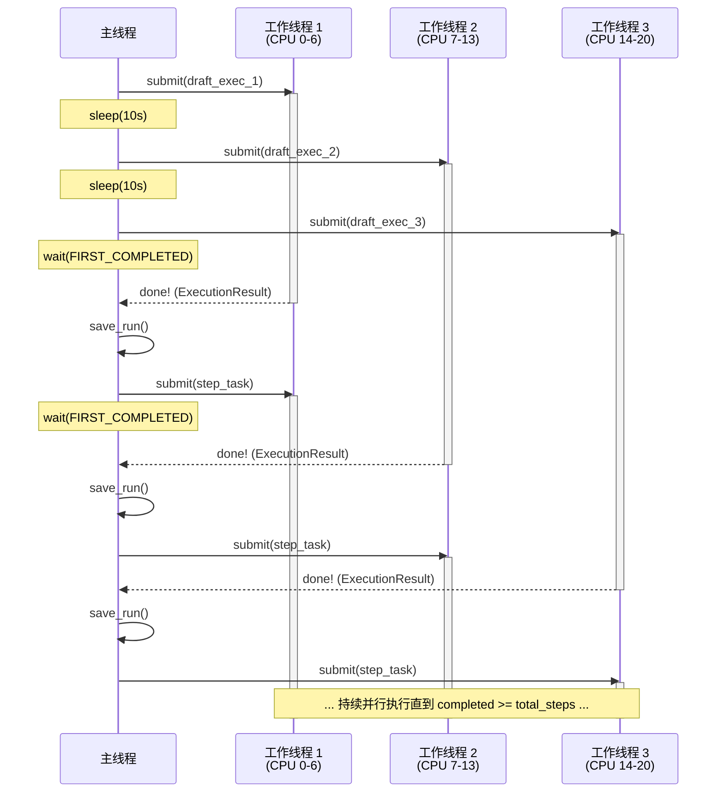
```mermaid
sequenceDiagram
    participant M as 主线程
    participant W1 as 工作线程 1<br>(CPU 0-6)
    participant W2 as 工作线程 2<br>(CPU 7-13)
    participant W3 as 工作线程 3<br>(CPU 14-20)

    M->>W1: submit(draft_exec_1)
    activate W1
    Note over M: sleep(10s)
    M->>W2: submit(draft_exec_2)
    activate W2
    Note over M: sleep(10s)
    M->>W3: submit(draft_exec_3)
    activate W3

    Note over M: wait(FIRST_COMPLETED)
    W1-->>M: done! (ExecutionResult)
    deactivate W1
    M->>M: save_run()
    M->>W1: submit(step_task)
    activate W1

    Note over M: wait(FIRST_COMPLETED)
    W2-->>M: done! (ExecutionResult)
    deactivate W2
    M->>M: save_run()
    M->>W2: submit(step_task)
    activate W2

    W3-->>M: done! (ExecutionResult)
    deactivate W3
    M->>M: save_run()
    M->>W3: submit(step_task)
    activate W3

    Note over W1,W3: ... 持续并行执行直到 completed >= total_steps ...
    deactivate W1
    deactivate W2
    deactivate W3
```

**CPU 亲和性分配**：
- 每个执行槽位被分配 `cpu_number / max_parallel_run` 个 CPU 核
- 使用 `os.sched_setaffinity()` 在子进程启动时绑定 CPU
- 例：21 核 / 3 并行 = 每槽 7 核: `{0-6}`, `{7-13}`, `{14-20}`

### 3.5 结果解析与评估时序

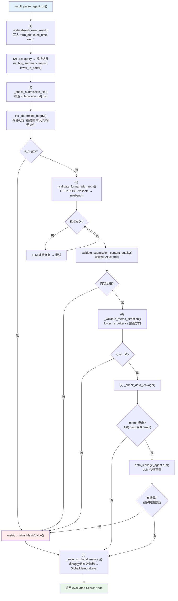
```mermaid
flowchart TD
    Start["result_parse_agent.run()"] --> Absorb["(1) node.absorb_exec_result()<br>写入 term_out, exec_time, exc_*"]
    Absorb --> LLMQuery["(2) LLM query → 解析结果<br>{is_bug, summary, metric, lower_is_better}"]
    LLMQuery --> CheckCSV["(3) _check_submission_file()<br>检查 submission_{id}.csv"]
    CheckCSV --> Buggy["(4) _determine_buggy()<br>综合判定: 错误|异常|无指标|无文件"]

    Buggy --> IsBuggy{"is_buggy?"}
    IsBuggy -->|是| SetWorst["metric = WorstMetricValue()"]
    IsBuggy -->|否| Format["(5) _validate_format_with_retry()<br>HTTP POST /validate → mlebench"]

    Format --> FormatOK{"格式有效?"}
    FormatOK -->|否| LLMFix["LLM 辅助修复 → 重试"]
    LLMFix --> FormatOK
    FormatOK -->|是| Quality["validate_submission_content_quality()<br>常量列 >95% 检测"]

    Quality --> QualityOK{"内容合格?"}
    QualityOK -->|否| SetWorst
    QualityOK -->|是| MetricDir["(6) _validate_metric_direction()<br>lower_is_better vs 预设方向"]

    MetricDir --> DirOK{"方向一致?"}
    DirOK -->|否| SetWorst
    DirOK -->|是| Leakage["(7) _check_data_leakage()"]

    Leakage --> IsExtreme{"metric 极端?<br>1.0(max) 或 0.0(min)"}
    IsExtreme -->|否| Save
    IsExtreme -->|是| LeakageCheck["data_leakage_agent.run()<br>LLM 代码审查"]
    LeakageCheck --> HasLeak{"有泄露?<br>(高/中置信度)"}
    HasLeak -->|是| SetWorst
    HasLeak -->|否| Save

    SetWorst --> Save["(8) _save_to_global_memory()<br>非buggy且有效指标 → GlobalMemoryLayer"]
    Save --> End["返回 evaluated SearchNode"]

    style Start fill:#e3f2fd
    style SetWorst fill:#ffebee
    style End fill:#e8f5e9
```

---

## 4. 算法设计 (Algorithm Design)

### 4.1 蒙特卡洛图搜索 (MCGS)

MLEvolve 的核心算法基于蒙特卡洛树搜索 (MCTS) 的变体，将其扩展为**图搜索 (MCGS)**，因为节点之间可以通过融合 (Fusion) 产生跨分支的信息流。

**搜索树结构**：

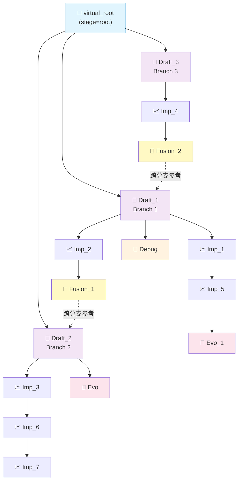
```mermaid
graph TD
    VR["🌳 virtual_root<br>(stage=root)"]

    D1["📝 Draft_1<br>Branch 1"]
    D2["📝 Draft_2<br>Branch 2"]
    D3["📝 Draft_3<br>Branch 3"]

    I1["📈 Imp_1"]
    I2["📈 Imp_2"]
    DBG["🔧 Debug"]
    I3["📈 Imp_3"]
    EVO1["🧬 Evo"]
    I4["📈 Imp_4"]

    I5["📈 Imp_5"]
    FUS1["🔀 Fusion_1"]
    I6["📈 Imp_6"]
    FUS2["🔀 Fusion_2"]

    EVO2["🧬 Evo_1"]
    I7["📈 Imp_7"]

    VR --> D1 & D2 & D3
    D1 --> I1 & I2 & DBG
    D2 --> I3 & EVO1
    D3 --> I4
    I1 --> I5
    I2 --> FUS1
    I3 --> I6
    I4 --> FUS2
    I5 --> EVO2
    I6 --> I7

    FUS1 -.->|"跨分支参考"| D2
    FUS2 -.->|"跨分支参考"| D1

    style VR fill:#e1f5fe,stroke:#0288d1
    style D1 fill:#f3e5f5
    style D2 fill:#f3e5f5
    style D3 fill:#f3e5f5
    style FUS1 fill:#fff9c4
    style FUS2 fill:#fff9c4
    style DBG fill:#fff3e0
    style EVO1 fill:#fce4ec
    style EVO2 fill:#fce4ec
```

**搜索循环的四个阶段 (对应 MCTS)**：

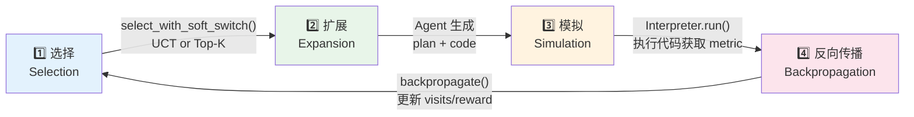
```mermaid
graph LR
    S["1️⃣ 选择<br>Selection"]
    E["2️⃣ 扩展<br>Expansion"]
    M["3️⃣ 模拟<br>Simulation"]
    B["4️⃣ 反向传播<br>Backpropagation"]

    S -->|"select_with_soft_switch()<br>UCT or Top-K"| E
    E -->|"Agent 生成<br>plan + code"| M
    M -->|"Interpreter.run()<br>执行代码获取 metric"| B
    B -->|"backpropagate()<br>更新 visits/reward"| S

    style S fill:#e3f2fd
    style E fill:#e8f5e9
    style M fill:#fff3e0
    style B fill:#fce4ec
```

### 4.2 UCT 选择算法

UCT (Upper Confidence Bound for Trees) 是 MCTS 中平衡探索与利用的经典算法。

**公式**：

```
UCT(node) = Q(node) + C × √(ln(N_parent) / N_node)

其中：
  Q(node)   = total_reward / visits       (利用项：平均奖励)
  C         = exploration_constant         (探索系数，随时间衰减)
  N_parent  = parent.visits               (父节点访问次数)
  N_node    = node.visits                 (当前节点访问次数)
```

**选择流程** (`select` 函数)：

```python
def select(agent, node):
    while node 非终止:
        if node 未达子节点上限:
            if node.is_buggy 且有非 buggy 子节点:
                node = UCT 最优子节点
            elif node.continue_improve 且有子节点:
                node = UCT 最优子节点
            else:
                return node  # 扩展此节点
        else:
            if 是根节点 且应触发分支融合:
                return node  # 返回根触发聚合
            node = UCT 最优子节点
    return node
```

**特殊处理**：
- 根节点的子节点 (draft/fusion_draft) 使用 `lock` 机制防止并发重复选择
- 未访问节点 (visits=0) 的 UCT 值为 `+∞`，确保优先探索

### 4.3 探索-利用软切换算法

系统实现了一个基于时间进度的探索-利用动态平衡策略：

```
exploration_weight(t) =
  ⎧ 1.0,                                          if t/T < switch_start (0.5)
  ⎨ 1.0 - (1-min_weight) × (t/T-start)/(end-start), if start ≤ t/T < switch_end (0.7)
  ⎩ min_weight (0.2),                              if t/T ≥ switch_end
```

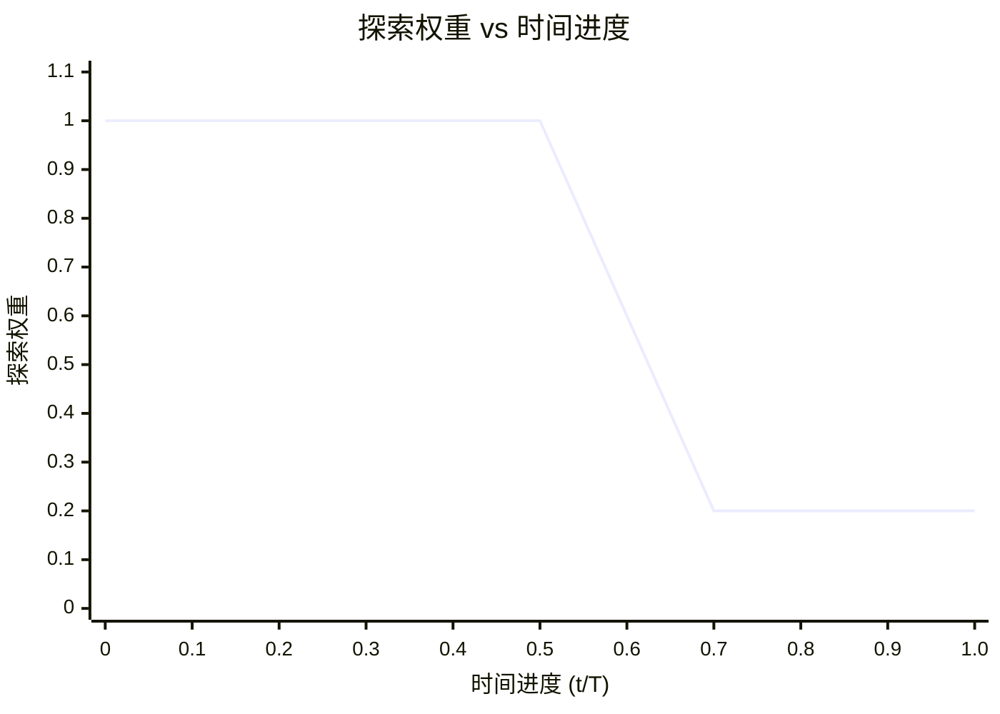
```mermaid
xychart-beta
    title "探索权重 vs 时间进度"
    x-axis "时间进度 (t/T)" [0, 0.1, 0.2, 0.3, 0.4, 0.5, 0.6, 0.7, 0.8, 0.9, 1.0]
    y-axis "探索权重" 0 --> 1.1
    line [1.0, 1.0, 1.0, 1.0, 1.0, 1.0, 0.6, 0.2, 0.2, 0.2, 0.2]
```

**选择逻辑**：

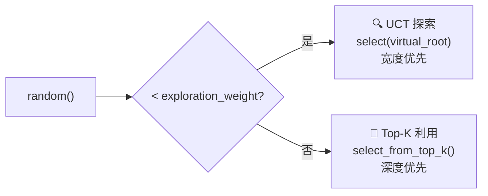
```mermaid
flowchart LR
    R["random()"]
    CMP{"< exploration_weight?"}
    UCT["🔍 UCT 探索<br>select(virtual_root)<br>宽度优先"]
    TopK["🎯 Top-K 利用<br>select_from_top_k()<br>深度优先"]

    R --> CMP
    CMP -->|是| UCT
    CMP -->|否| TopK
```

**Top-K 参数随时间变化**：

| 阶段 | 时间进度 | K 值 | 每分支最大 |
|------|---------|------|----------|
| 早中期 | < 70% | `topk_early_k` (5) | `topk_early_max_per_branch` (3) |
| 后期 | ≥ 70% | `topk_late_k` (3) | `topk_late_max_per_branch` (2) |

### 4.4 Top-K 加权选择算法

从全局 Top-K 节点中进行加权随机选择：

**Top-K 节点收集** (`get_top_k_nodes_global`)：

```python
1. 收集所有分支中非 buggy 且有有效 metric 的节点
2. 按 metric 排序 (maximize 降序 / minimize 升序)
3. 贪心选择 K 个节点，同一分支最多选 max_from_same_branch 个
   → 保证分支多样性
```

**加权随机选择** (`select_from_top_k_weighted`)：

```
权重: w_i = 1 / rank_i
概率: p_i = w_i / Σw_j

例 (K=3): Rank 1 → p=6/11, Rank 2 → p=3/11, Rank 3 → p=2/11
```

### 4.5 停滞检测与自适应策略

系统实现了多层次的停滞检测机制：

#### 4.5.1 分支停滞检测 (`is_branch_stagnant`)

```python
def is_branch_stagnant(agent, branch_id, threshold):
    # 获取分支中最近的 threshold 个成功节点
    recent_nodes = branch_successful_nodes[-threshold:]
    branch_best = max(branch_successful_nodes, by=metric)

    # 如果所有最近节点都未超过分支最佳 → 停滞
    consecutive_no_improvement = count(
        n for n in recent_nodes if n.metric < branch_best.metric
    )
    return consecutive_no_improvement >= len(recent_nodes) >= 2
```

**停滞阈值**：
- 普通分支: `branch_stagnation_threshold` = 3
- Top-K 触发的分支: `topk_stagnation_threshold` = 6 (更宽松)

#### 4.5.2 全局停滞检测 (`is_globally_stagnant`)

```python
def is_globally_stagnant(agent):
    recent_nodes = journal.nodes[-stagnation_window:]
    for node in recent_nodes:
        if improvement(node, best_node) > metric_improvement_threshold:
            return False
    return True
```

#### 4.5.3 改进耐心计数 (`get_patience_counter`)

跟踪分支中连续未改进的节点数，用于触发策略切换：

```python
success_patience = len(successful_nodes) - best_index - 1  # 成功但未改进的节点数
total_patience = len(all_nodes) - best_index - 1           # 总节点数（含失败）

# 触发条件：
if success_patience >= 2 or total_patience >= 5:
    → 使用 "Magnitude-Based Reasoning" 提示
    → 要求 Tier 2/3 级别的重大变更
```

#### 4.5.4 自适应策略选择

当检测到停滞时，系统自动切换策略：

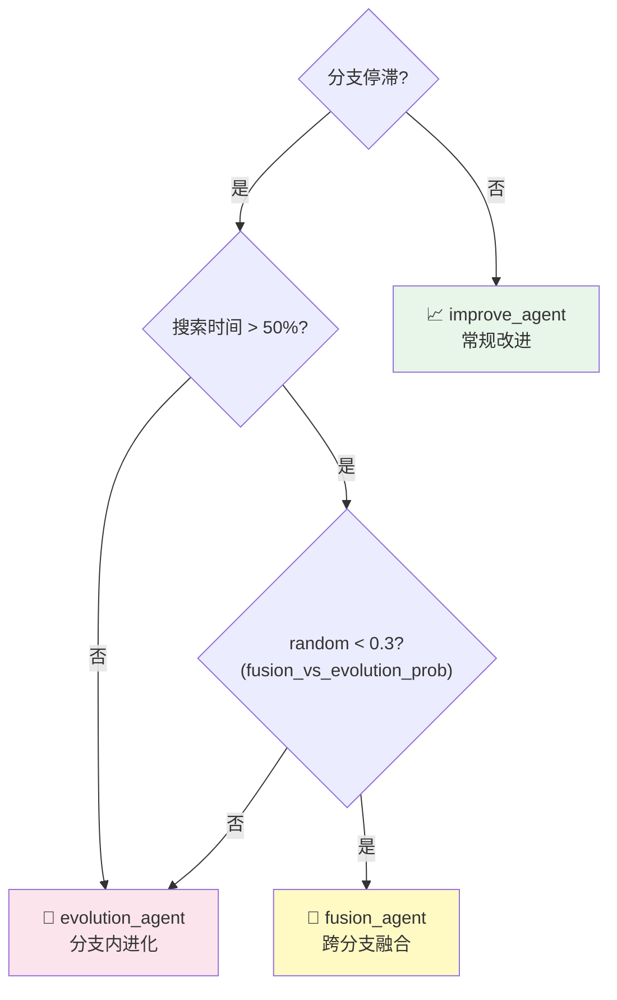
```mermaid
flowchart TD
    Start{"分支停滞?"}
    TimeCheck{"搜索时间 > 50%?"}
    ProbCheck{"random < 0.3?<br>(fusion_vs_evolution_prob)"}

    Improve["📈 improve_agent<br>常规改进"]
    Evolution["🧬 evolution_agent<br>分支内进化"]
    Fusion["🔀 fusion_agent<br>跨分支融合"]

    Start -->|否| Improve
    Start -->|是| TimeCheck
    TimeCheck -->|否| Evolution
    TimeCheck -->|是| ProbCheck
    ProbCheck -->|是| Fusion
    ProbCheck -->|否| Evolution

    style Improve fill:#e8f5e9
    style Evolution fill:#fce4ec
    style Fusion fill:#fff9c4
```

### 4.6 反向传播与奖励计算

#### 4.6.1 奖励函数 (`get_node_reward`)

```python
def get_node_reward(agent, node):
    if node.is_buggy or node.metric is None:
        return -1                          # 失败惩罚

    reward = 0
    if node.metric > agent.best_metric:
        reward += 1.5                      # 全局最佳奖励

    if parent.stage != "root":
        if parent.is_buggy:
            reward += 1.5                  # 调试成功额外奖励
        else:
            reward += 1.0                  # 基础改进奖励

    return reward
```

**奖励值总结**：

| 情况 | 奖励值 |
|------|-------|
| buggy 或无指标 | -1 |
| 成功但无改进 | +1 |
| 调试成功 | +1.5 |
| 全局最佳 | +1.5 (累加) |
| 调试成功 + 全局最佳 | +3.0 |

#### 4.6.2 反向传播 (`backpropagate`)

从当前节点向根节点逐层传播奖励：

```python
def backpropagate(node, value, add_to_tree=True):
    while node is not None:
        # 更新调试成功标记
        if node.is_buggy is False and parent.is_buggy:
            parent.is_debug_success = True

        # 传播 continue_improve 标记
        if parent.stage != "root":
            parent.continue_improve = node.continue_improve

        # 解锁 draft/fusion_draft 节点
        if node.stage in ["draft", "fusion_draft"] and node.lock:
            node.lock = False

        # 更新 MCTS 统计量
        node.visits += 1
        node.total_reward += value

        node = node.parent
```

#### 4.6.3 条件性反向传播 (`check_improvement`)

`check_improvement` 决定是否触发反向传播，这是搜索策略的核心判断点：

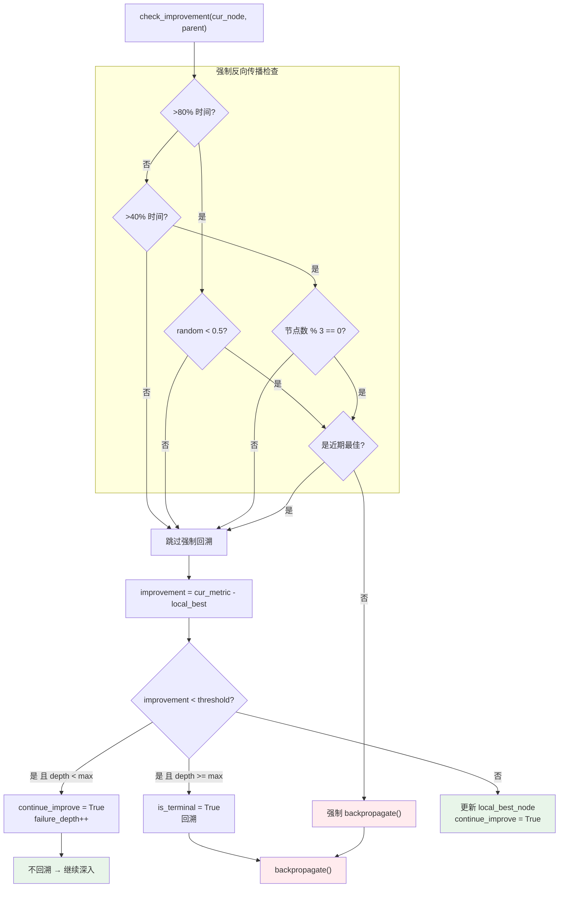
```mermaid
flowchart TD
    Start["check_improvement(cur_node, parent)"]

    subgraph Force["强制反向传播检查"]
        Late{">80% 时间?"}
        LateProb{"random < 0.5?"}
        Mid{">40% 时间?"}
        MidMod{"节点数 % 3 == 0?"}
        Smart{"是近期最佳?"}
    end

    Late -->|是| LateProb
    LateProb -->|是| Smart
    Late -->|否| Mid
    Mid -->|是| MidMod
    MidMod -->|是| Smart
    Mid -->|否| NormalEval
    LateProb -->|否| NormalEval
    MidMod -->|否| NormalEval
    Smart -->|是| NormalEval["跳过强制回溯"]
    Smart -->|否| ForceBack["强制 backpropagate()"]

    Start --> Late

    NormalEval --> ImpCalc["improvement = cur_metric - local_best"]
    ImpCalc --> ImpCheck{"improvement < threshold?"}

    ImpCheck -->|"是 且 depth < max"| Continue["continue_improve = True<br>failure_depth++"]
    ImpCheck -->|"是 且 depth >= max"| Terminal["is_terminal = True<br>回溯"]
    ImpCheck -->|否| Better["更新 local_best_node<br>continue_improve = True"]

    Continue --> NoBack["不回溯 → 继续深入"]
    Terminal --> DoBack["backpropagate()"]
    ForceBack --> DoBack

    style ForceBack fill:#ffebee
    style DoBack fill:#ffebee
    style NoBack fill:#e8f5e9
    style Better fill:#e8f5e9
```

```
check_improvement(cur_node, parent_node)
  │
  ├── 强制反向传播检查 (Force Backprop)
  │   ├── 后期 (>80% 时间): 50% 概率强制回溯
  │   ├── 中期 (>40% 时间): 每 3 个节点强制回溯
  │   └── 智能跳过: 如果是近期最佳节点，不强制回溯
  │
  ├── 改进判定
  │   ├── improvement = cur_metric - local_best_metric
  │   ├── improvement < threshold 且 failure_depth < max_failure:
  │   │   → continue_improve = True (继续尝试)
  │   ├── improvement < threshold 且 failure_depth >= max_failure:
  │   │   → is_terminal = True (终止此路径，回溯)
  │   └── improvement >= threshold:
  │       → 更新 local_best_node, continue_improve = True
  │
  └── 回溯判定
      ├── should_backpropagate = True → 执行 backpropagate()
      └── should_backpropagate = False → 加入 current_node_list (继续深入)
```

### 4.7 分支管理与融合策略

#### 4.7.1 分支生命周期

```
新分支创建 → register_node(new_branch=True)
  ├── branch_id = next_branch_id++
  ├── branch_all_nodes[id] = [node]
  └── branch_successful_nodes[id] = []

分支内新节点 → register_node(parent_node=parent)
  ├── node.branch_id = parent.branch_id
  └── branch_all_nodes[id].append(node)

分支成功节点 → validate_executed_node()
  └── branch_successful_nodes[id].append(node)
```

#### 4.7.2 多分支聚合触发条件 (`should_trigger_branch_fusion`)

```python
条件（ALL 必须满足）：
1. fusion_draft_count < max_fusion_drafts (2)
2. 已过 fusion_min_time_hours (6h)
3. 未超 fusion_max_time_hours (10h)
4. 至少 fusion_min_branches (2) 个分支有 >= fusion_min_successful_nodes (2) 个成功节点
5. 全局停滞 (is_globally_stagnant)
6. random() < branch_fusion_trigger_prob (1.0)
```

#### 4.7.3 融合策略层次

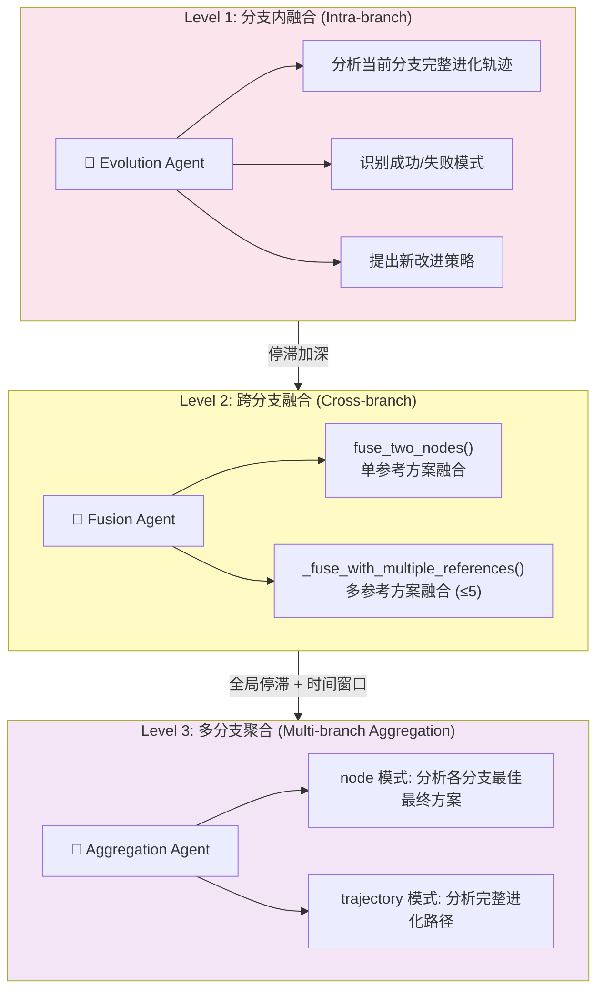
```mermaid
graph TB
    subgraph L1["Level 1: 分支内融合 (Intra-branch)"]
        EA["🧬 Evolution Agent"]
        EA --> EA1["分析当前分支完整进化轨迹"]
        EA --> EA2["识别成功/失败模式"]
        EA --> EA3["提出新改进策略"]
    end

    subgraph L2["Level 2: 跨分支融合 (Cross-branch)"]
        FA["🔀 Fusion Agent"]
        FA --> FA1["fuse_two_nodes()<br>单参考方案融合"]
        FA --> FA2["_fuse_with_multiple_references()<br>多参考方案融合 (≤5)"]
    end

    subgraph L3["Level 3: 多分支聚合 (Multi-branch Aggregation)"]
        AA["🔗 Aggregation Agent"]
        AA --> AA1["node 模式: 分析各分支最佳最终方案"]
        AA --> AA2["trajectory 模式: 分析完整进化路径"]
    end

    L1 -->|"停滞加深"| L2
    L2 -->|"全局停滞 + 时间窗口"| L3

    style L1 fill:#fce4ec
    style L2 fill:#fff9c4
    style L3 fill:#f3e5f5
```

### 4.8 全局记忆与混合检索

#### 4.8.1 记忆存储策略

每个非 buggy 的成功节点被保存到全局记忆：

```python
MemRecord = {
    record_id: "node_{uuid}",
    title: "{stage} - {id[:8]}",
    description: node.plan,       # 方案描述
    method: code_summary,          # 代码摘要（来自 LLM 或自动提取）
    label: determine_label(),      # +1=改进, 0=持平, -1=退步
    timestamp: now()
}

metadata = {
    exec_time, parent_metric, current_metric,
    parent_error (仅 debug 阶段)
}
```

#### 4.8.2 混合检索算法 (`HybridRetriever`)

全局记忆使用混合检索：结合**向量相似度**和**关键词匹配**：

```
score(query, record) = α × vector_similarity + (1-α) × keyword_similarity

其中 α = 0.5 (默认)
vector_similarity: 使用 BAAI/bge-base-en-v1.5 计算嵌入向量余弦相似度
keyword_similarity: 基于 TF-IDF 的关键词匹配
```

**检索支持的过滤条件**：
- `label_filter`: 按 label 过滤 (1=成功, -1=失败)
- `stage_filter`: 按 stage 过滤 (debug, improve, etc.)
- `dissimilar=True`: 返回最不相似的记录 (促进多样性)

#### 4.8.3 记忆增强规划 (Memory-Enhanced Planning)

当启用全局记忆时，Improve Agent 使用两阶段规划：

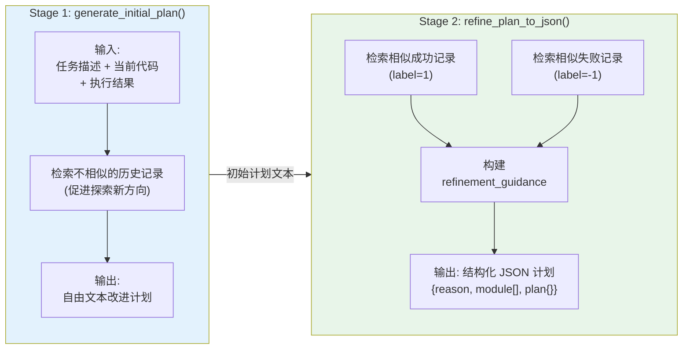
```mermaid
flowchart LR
    subgraph Stage1["Stage 1: generate_initial_plan()"]
        S1In["输入:<br>任务描述 + 当前代码<br>+ 执行结果"]
        S1Mem["检索不相似的历史记录<br>(促进探索新方向)"]
        S1Out["输出:<br>自由文本改进计划"]
        S1In --> S1Mem --> S1Out
    end

    subgraph Stage2["Stage 2: refine_plan_to_json()"]
        S2Succ["检索相似成功记录<br>(label=1)"]
        S2Fail["检索相似失败记录<br>(label=-1)"]
        S2Guide["构建<br>refinement_guidance"]
        S2Out["输出: 结构化 JSON 计划<br>{reason, module[], plan{}}"]
        S2Succ & S2Fail --> S2Guide --> S2Out
    end

    Stage1 -->|"初始计划文本"| Stage2

    style Stage1 fill:#e3f2fd
    style Stage2 fill:#e8f5e9
```

### 4.9 探索常数衰减算法

UCT 中的探索常数 C 随搜索进度分段衰减：

```
C(t) =
  ⎧ initial_C (1.414),                              if t < T1
  ⎨ max(initial_C - α×(t-T1), lower_bound),         if T1 ≤ t ≤ T2
  ⎩ lower_bound (0.5),                              if t > T2

其中:
  T1 = min(num_drafts × num_improves², steps × phase_ratios[0])
  T2 = steps × phase_ratios[1]
  α  = 0.01 (线性衰减率)
```

```
 C (探索常数)
 1.414 ──────────┐
                 │
                 └───────────┐
                             └──────────── 0.5
   ──────┬──────────┬────────────┬──── 搜索步数
         0         T1           T2
```

**设计意图**：
- 早期 (t < T1): 高探索，充分展开搜索树
- 中期 (T1 ~ T2): 线性衰减，逐步聚焦
- 后期 (t > T2): 低探索，集中利用已发现的好路径

### 4.10 Diff 模式代码生成

系统支持两种代码生成模式：

#### 4.10.1 全量重写模式 (Full Rewrite)

LLM 直接输出完整的 Python 脚本。用于 Draft 和 Fallback 场景。

#### 4.10.2 Diff 模式 (SEARCH/REPLACE Patch)

对于 Improve/Evolution/Fusion 场景，使用增量修改：

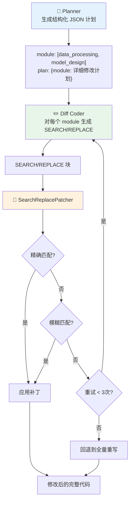
```mermaid
flowchart TD
    P["🧠 Planner<br>生成结构化 JSON 计划"]
    P --> J["module: [data_processing, model_design]<br>plan: {module: 详细修改计划}"]

    J --> DC["✏️ Diff Coder<br>对每个 module 生成 SEARCH/REPLACE"]
    DC --> Patch["SEARCH/REPLACE 块"]

    Patch --> SRP["🔧 SearchReplacePatcher"]
    SRP --> Exact{"精确匹配?"}
    Exact -->|是| Apply["应用补丁"]
    Exact -->|否| Fuzzy{"模糊匹配?"}
    Fuzzy -->|是| Apply
    Fuzzy -->|否| Retry{"重试 < 3次?"}
    Retry -->|是| DC
    Retry -->|否| Fallback["回退到全量重写"]

    Apply --> Out["修改后的完整代码"]
    Fallback --> Out

    style P fill:#e3f2fd
    style DC fill:#e8f5e9
    style SRP fill:#fff3e0
```

**Stepwise 代码生成** (用于 Draft)：

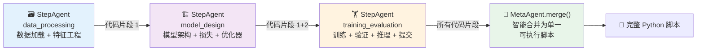
```mermaid
flowchart LR
    S1["🗃️ StepAgent<br>data_processing<br>数据加载 + 特征工程"]
    S2["🏗️ StepAgent<br>model_design<br>模型架构 + 损失 + 优化器"]
    S3["🏋️ StepAgent<br>training_evaluation<br>训练 + 验证 + 推理 + 提交"]
    MA["🔗 MetaAgent.merge()<br>智能合并为单一<br>可执行脚本"]

    S1 -->|"代码片段 1"| S2
    S2 -->|"代码片段 1+2"| S3
    S3 -->|"所有代码片段"| MA
    MA --> Final["📄 完整 Python 脚本"]

    style S1 fill:#e3f2fd
    style S2 fill:#f3e5f5
    style S3 fill:#fff3e0
    style MA fill:#e8f5e9
```

---

## 5. 模块架构设计

### 5.1 整体架构

```mermaid
graph TB
    subgraph Entry["🚪 Entry Points"]
        RunPy["run.py<br>(CLI)"]
        InitPy["__init__.py<br>(API)"]
        Shell["Shell Scripts"]
    end

    subgraph Config["⚙️ Config Layer"]
        CfgInit["config/__init__.py"]
        CfgYAML["config.yaml"]
        Omega["OmegaConf"]
    end

    subgraph Engine["🔧 Engine Layer (搜索协调)"]
        AS["AgentSearch<br>协调器"]
        NS["NodeSelection<br>节点选择"]
        EV["Evaluation<br>评估反传"]
        SN["SearchNode<br>+ Journal"]
        EX["Execution<br>验证"]
        SM["SolutionManager<br>解管理"]
        CD["Conditions<br>触发条件"]
        INT["Executor<br>子进程执行"]
    end

    subgraph Agents["🤖 Agent Layer (多智能体)"]
        direction TB
        subgraph CoreAgents["核心 Agent"]
            Draft["Draft"]
            Improve["Improve"]
            Debug["Debug"]
            Evolution["Evolution"]
            Fusion["Fusion"]
            Aggregation["Aggregation"]
        end
        subgraph SupportAgents["辅助 Agent"]
            CodeReview["CodeReview"]
            ResultParse["ResultParse"]
            DataLeakage["DataLeakage"]
        end
        subgraph SubSys["子系统"]
            Planner["Planner<br>规划器"]
            Coder["Coder<br>代码生成"]
            Memory["Memory<br>全局记忆"]
        end
    end

    subgraph LLM["🧠 LLM Abstraction Layer"]
        Router["__init__.py<br>路由器"]
        Gemini["Gemini<br>Backend"]
        OpenAI["OpenAI Compat<br>Backend"]
    end

    subgraph Validation["✅ Validation Layer"]
        FS["FormatServer<br>(Flask)"]
        FC["FormatClient"]
        QC["QualityCheck"]
    end

    Entry --> Config --> Engine
    Engine --> Agents
    Agents --> LLM
    Agents --> Validation
    Engine --> INT

    style Entry fill:#e3f2fd
    style Config fill:#f5f5f5
    style Engine fill:#e8f5e9
    style Agents fill:#fff3e0
    style LLM fill:#f3e5f5
    style Validation fill:#fce4ec
```

### 5.2 Agent 子系统

#### 5.2.1 Agent 职责矩阵

| Agent | 文件 | 输入 | 输出 | 核心职责 |
|-------|------|------|------|---------|
| **DraftAgent** | `draft_agent.py` | task_desc, data_preview, memory | SearchNode(stage="draft") | 生成初始解决方案 |
| **ImproveAgent** | `improve_agent.py` | parent_node (非 buggy) | SearchNode(stage="improve") | 改进现有方案 |
| **DebugAgent** | `debug_agent.py` | parent_node (buggy) | SearchNode(stage="debug") | 修复代码 bug |
| **EvolutionAgent** | `evolution_agent.py` | parent_node + 分支轨迹 | SearchNode(stage="evolution") | 基于进化轨迹改进 |
| **FusionAgent** | `fusion_agent.py` | parent_node + 跨分支参考 | SearchNode(stage="fusion") | 跨分支经验融合 |
| **AggregationAgent** | `aggregation_agent.py` | 多分支最佳节点 | SearchNode(stage="fusion_draft") | 综合多分支创建新方案 |
| **CodeReviewAgent** | `code_review_agent.py` | node.code | str (修正后代码) | 代码审查与修正 |
| **ResultParseAgent** | `result_parse_agent.py` | node + ExecutionResult | SearchNode (带评估结果) | 解析执行结果 |
| **DataLeakageAgent** | `data_leakage_agent.py` | node.code | dict {has_leakage, confidence, reason} | 数据泄露检测 |

#### 5.2.2 Agent 调用决策树

```python
def choose_agent(agent, parent_node):
    if is_root(parent_node):
        if reached_child_limit(parent_node):
            return aggregation_agent  # 聚合
        return draft_agent            # 新草案

    if parent_node.is_buggy:
        return debug_agent            # 调试

    if is_branch_stagnant(parent_node.branch_id):
        if time_elapsed > time_limit / 2:
            if random() < fusion_vs_evolution_prob:
                return fusion_agent   # 跨分支融合
            return evolution_agent    # 分支内进化
        return evolution_agent        # 分支内进化

    return improve_agent              # 常规改进
```

### 5.3 Engine 子系统

| 模块 | 文件 | 核心功能 |
|------|------|---------|
| **AgentSearch** | `agent_search.py` | 搜索协调器，管理整个搜索生命周期 |
| **SearchNode + Journal** | `search_node.py` | 搜索树数据结构，节点管理，轨迹生成 |
| **NodeSelection** | `node_selection.py` | UCT 选择，Top-K 选择，软切换策略 |
| **Evaluation** | `evaluation.py` | 奖励计算，反向传播，改进判定 |
| **Execution** | `execution.py` | 执行后验证（提交文件存在性，指标异常检测） |
| **Executor (Interpreter)** | `executor.py` | 子进程执行引擎，并行管理，CPU 亲和性 |
| **SolutionManager** | `solution_manager.py` | Top-K 维护，最优解持久化 |
| **Conditions** | `conditions.py` | 分支融合触发条件，停滞检测 |
| **ColdStart** | `coldstart/` | 冷启动知识库：任务分类 + 模型推荐 |

### 5.4 LLM 抽象层

```
llm/__init__.py
  │
  ├── query(system_message, user_message, func_spec, model, ...) → OutputType
  │   └── 统一的结构化查询接口（支持函数调用）
  │
  ├── generate(prompt, cfg, json_schema, ...) → str
  │   └── 统一的文本生成接口（支持 JSON Schema）
  │
  ├── _provider(model) → "gemini" | "openai"
  │   └── 根据模型名称路由到对应后端
  │
  ├── gemini.py
  │   ├── Google GenAI SDK
  │   ├── 支持 FunctionSpec (结构化输出)
  │   ├── 流式生成
  │   └── 自动重试 (最多 20 次)
  │
  └── openai.py
      ├── OpenAI-compatible API (支持 Qwen 等)
      ├── 支持 Chat Completion 格式
      ├── 支持 JSON Schema 约束
      └── 自动重试
```

**Prompt 格式适配**：
- Gemini: 纯文本拼接 `introduction + user_prompt + assistant_prefix`
- OpenAI-compatible: Chat 字典 `{system, user, assistant}`
- 由 `build_chat_prompt_for_model()` 自动适配

### 5.5 代码生成子系统

```mermaid
graph TB
    subgraph Coder["agents/coder/"]
        subgraph Base["base_coder.py"]
            BC["plan_and_code_query()"]
            BC --> BC1["单次 LLM 调用"]
            BC1 --> BC2["extract_text_up_to_code() → plan"]
            BC1 --> BC3["extract_code() → code"]
        end

        subgraph Stepwise["stepwise_coder.py"]
            SW["stepwise_plan_and_code_query()"]
            SW --> SA1["StepAgent: data_processing"]
            SW --> SA2["StepAgent: model_design"]
            SW --> SA3["StepAgent: training_evaluation"]
            SA1 & SA2 & SA3 --> MA["MetaAgent.merge()"]
        end

        subgraph Diff["diff_coder/"]
            DGA["diff_generate_and_apply()"]
            DGA --> PR["prompts.py<br>SEARCH/REPLACE 格式"]
            DGA --> DG["diff_generate.py<br>按模块生成 diff"]
            DGA --> PT["patcher.py<br>SearchReplacePatcher"]
            DGA --> AP["apply.py<br>多模块串行 + 重试"]
        end
    end

    Draft["DraftAgent"] -->|"初始方案"| Stepwise
    Draft -->|"回退"| Base
    Improve["ImproveAgent"] -->|"增量改进"| Diff
    Improve -->|"回退"| Base
    Evolution["EvolutionAgent"] --> Diff
    Fusion["FusionAgent"] --> Diff

    style Base fill:#e3f2fd
    style Stepwise fill:#e8f5e9
    style Diff fill:#fff3e0
```

### 5.6 验证与质量保障子系统

```mermaid
graph LR
    subgraph Pipeline["验证管线 (6 步)"]
        direction LR
        V1["1️⃣ 文件存在<br>submission_{id}.csv"]
        V2["2️⃣ 零值异常<br>metric==0 且 maximize"]
        V3["3️⃣ 格式验证<br>mlebench /validate"]
        V4["4️⃣ 内容质量<br>常量列 >95%"]
        V5["5️⃣ 方向一致<br>lower_is_better"]
        V6["6️⃣ 泄露检测<br>极端值审查"]

        V1 -->|"✅ 通过"| V2
        V2 -->|"✅ 通过"| V3
        V3 -->|"✅ 通过"| V4
        V4 -->|"✅ 通过"| V5
        V5 -->|"✅ 通过"| V6
        V6 -->|"✅ 通过"| OK["✅ Valid Node"]
    end

    V1 -->|"❌ 不存在"| BUG["❌ Buggy"]
    V2 -->|"❌ 零值"| BUG
    V3 -->|"❌ 格式错"| BUG
    V4 -->|"❌ 常量预测"| BUG
    V5 -->|"❌ 方向不一致"| BUG
    V6 -->|"❌ 高置信度泄露"| BUG

    style OK fill:#e8f5e9,stroke:#43a047
    style BUG fill:#ffebee,stroke:#e53935
```

---

## 6. 配置体系

### 6.1 配置层次

```yaml
# 数据与路径
data_dir / dataset_dir / workspace_dir / log_dir

# 执行参数
exec.timeout: 32400          # 9 小时执行超时
exec.agent_file_name: runfile.py

# 搜索参数
agent.steps: 500             # 最大搜索步数
agent.time_limit: 43200      # 12 小时时间限制
agent.initial_drafts: 3      # 初始顺序生成的草案数
agent.seed: 42

# LLM 配置
agent.code.model / temp / base_url / api_key    # 代码生成 LLM
agent.feedback.model / temp / base_url / api_key  # 结果解析 LLM

# 搜索树参数 (agent.search.*)
parallel_search_num: 3       # 并行搜索数
num_drafts: 5                # 最大草案数
num_improves: 3              # 每节点最大改进尝试
num_bugs: 1                  # 每 buggy 节点最大调试尝试
max_debug_depth: 20          # 最大调试深度
metric_improvement_threshold: 0.0001  # 改进阈值
stagnation_window: 4         # 停滞检测窗口
top_candidates_size: 20      # Top-K 候选池大小

# 探索-利用切换
explore_switch_start: 0.5    # 开始减少探索的时间点
explore_switch_end: 0.7      # 最小探索权重的时间点
min_exploration_weight: 0.2  # 最小探索概率

# 探索常数衰减 (agent.decay.*)
exploration_constant: 1.414  # 初始探索常数 (√2)
lower_bound: 0.5             # 最低探索常数
alpha: 0.01                  # 线性衰减率
phase_ratios: [0.3, 0.7]    # 衰减阶段分界点

# 融合条件
fusion_min_time_hours: 6     # 最早融合时间
fusion_max_time_hours: 10    # 最晚融合时间
fusion_min_branches: 2       # 最少分支数
fusion_vs_evolution_prob: 0.3  # 融合 vs 进化概率

# 冷启动
coldstart.use_coldstart: True
coldstart.task_json_path: "engine/coldstart/competition_tag_classified.json"
coldstart.model_json_path: "engine/coldstart/models_guidance_classified.json"
```

### 6.2 关键参数交互关系

```mermaid
flowchart TD
    ND["num_drafts = 5<br>分支数量上限"]
    NI["num_improves = 3<br>每节点改进上限"]
    MIF["max_improve_failure = 3<br>终止判定"]
    BST["branch_stagnation_threshold = 3<br>停滞检测"]
    EF["evolution / fusion<br>策略切换"]
    ES["explore_switch_start=0.5<br>explore_switch_end=0.7"]
    UCT["UCT 探索"]
    TopK["Top-K 利用"]
    TL["time_limit = 43200<br>时间限制"]

    ND -->|"控制"| NI
    NI -->|"超限"| MIF
    MIF -->|"达到"| BST
    BST -->|"停滞触发"| EF
    TL -->|"时间进度"| ES
    ES -->|"权重切换"| UCT
    ES -->|"权重切换"| TopK
    UCT <-->|"软切换"| TopK

    style ND fill:#e3f2fd
    style EF fill:#fff9c4
    style UCT fill:#e8f5e9
    style TopK fill:#fce4ec
```

---

## 7. 数据流设计

### 7.1 端到端数据流

```mermaid
flowchart LR
    subgraph Input["📥 输入"]
        DataDir["data_dir/<br>train.csv<br>test.csv<br>sample_sub.csv"]
        TaskDesc["task_desc<br>任务描述"]
    end

    subgraph Core["⚙️ 处理核心"]
        LLM["🧠 LLM Service<br>(Gemini / OpenAI)"]
        SN["SearchNode<br>plan + code"]
        Interp["Interpreter<br>subprocess 执行"]
        ExecRes["ExecutionResult"]
        Valid["Validation<br>+ Evaluation"]
    end

    subgraph Output["📤 输出"]
        Logs["logs/<br>journal.json<br>config.yaml<br>best_solution.py"]
        Sub["submission/<br>submission_{id}.csv"]
        Best["best_solution/<br>solution.py<br>metric.txt"]
        Top["top_solution/<br>top1~topN/"]
        Mem["global_memory/<br>records.json"]
    end

    DataDir --> LLM
    TaskDesc --> LLM
    LLM --> SN
    SN --> Interp
    Interp --> ExecRes
    ExecRes --> Valid
    Valid --> Logs & Sub & Best & Top & Mem

    style Input fill:#e3f2fd
    style Core fill:#fff3e0
    style Output fill:#e8f5e9
```

### 7.2 Journal 序列化格式

```json
{
  "nodes": [
    {
      "id": "abc123...",
      "code": "import ...",
      "plan": "Use XGBoost with ...",
      "stage": "draft",
      "step": 1,
      "metric": {"value": 0.85, "maximize": true},
      "is_buggy": false,
      "is_valid": true,
      "visits": 5,
      "total_reward": 3.5,
      "branch_id": 1,
      "_term_out": ["Epoch 1: loss=0.32 ..."],
      "exec_time": 120.5,
      "analysis": "Model achieved 0.85 accuracy..."
    }
  ],
  "node2parent": {"abc123": "root_id", ...},
  "node2best_local_node": {"abc123": "abc123", ...}
}
```

---

> **文档版本**: v1.0
> **分析日期**: 2026-03-26
> **分析对象**: MLEvolve 完整源码
